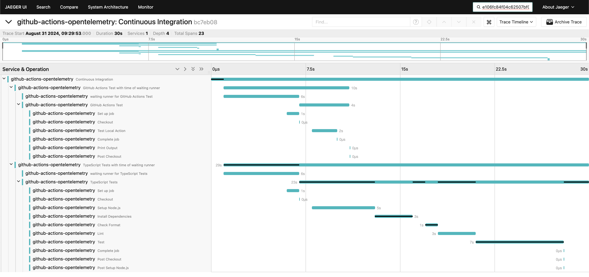

TODO: 最後にまとめ文を追加する

[:contents]

# はじめに

GitHub Actionsは、リポジトリ内のコードをビルド・テスト・デプロイするCI/CDワークフローなどを手軽に構築できるサービスです。
しかし、そのワークフロー実行時間の詳細な可視化や、変更による効果測定には工夫が必要です。
本ブログでは、OpenTelemetryを活用してGitHub Actionsの実行状況をトレース＆メトリクス化する[GitHub Actions OpenTelemetry](https://github.com/marketplace/actions/github-actions-opentelemetry)を紹介します。
これにより、どのステップに時間がかかっているか、改善施策の効果がどの程度あったのかなどを把握しやすくなります。



# GitHub Actionsにおける課題

## ワークフローの実行結果を視覚的に確認する方法が提供されていない

GitHub Actionsではサマリー機能によりジョブの実行時間や依存関係などの概要を確認することができます。


一方で各ステップの実行時間やエラーの発生箇所など、より詳細な情報を把握するためには、ジョブのログを手動で確認する必要があります。単純なワークフローであれば問題ないですが、ステップ数が多い場合や複数のジョブを持つワークフローの場合、手動でログを確認するのは手間がかかります。

## ワークフローの変更による影響を分析しづらい

GitHubからはActions metricsが提供されており、失敗率や平均実行時間は参照できます。


しかし、ワークフローの変更による影響を定量的に確認する上では施策導入前後の比較や平均以外の統計値（パーセンタイルなど）を把握したい場合も多いです。現状では、これらの情報を取得するためには、GitHub ActionsのAPIを利用して自前で集計する必要があります。

# GitHub Actions OpenTelemetryとは

## 概要と基本的な機能

[GitHub Actions OpenTelemetry](https://github.com/marketplace/actions/github-actions-opentelemetry)は、GitHub Actionsのワークフロー、ジョブ、ステップの結果を収集し、トレースとメトリクスをOpenTelemetry Protocol（OTLP）エンドポイントに送信する仕組みを提供します。主な機能は以下のとおりです。

- GitHub Actionsのワークフローとジョブ実行時間のメトリクスを収集  
- GitHub Actionsのワークフロー、ジョブ、ステップのトレースを収集  
- OTLP互換のバックエンドにデータを送信し、モニタリングと観測が可能 

GitHub Actions OpenTelemetryにより、ワークフローの実行状況をトレースやメトリクスとして可視化でき、ボトルネックやエラー箇所を特定しやすくなります。
また、施策前後の効果測定が容易になり、改善の優先度付けやROIを定量的に示せるようになります。

## OpenTelemetryとは

OpenTelemetryは、トレースやメトリクス、ログなどのテレメトリーデータを生成・管理するためのオープンソースのフレームワークです。
ベンダーロックインを排除し、JaegerやPrometheusなどのさまざまなツールやサービスと連携可能です。
そのため、GitHub Actions OpenTelemetryを利用することで、自分好みの監視基盤にシームレスに統合できます。

# 導入方法

GitHub Actions OpenTelemetryの導入は比較的シンプルで、下記のサンプルワークフローを参考に導入できます。

1. **OTLPエンドポイントの準備**  
   まず、JaegerやPrometheusなどのOTLP互換バックエンドを用意しておき、テレメトリーデータを受信できる状態にします。  
2. **GitHub Actions Workflowの作成**  
   `workflow_run`イベントを使用し、完了したワークフローからメトリクスやトレースを収集するためのワークフローを新たに作成します。

### 最小限の設定とサンプルワークフロー

```yaml
name: Send Telemetry after Other Workflow

on:
  workflow_run:
    # 監視対象にしたいワークフロー名を指定
    workflows:
      - Check Transpiled JavaScript
      - Continuous Integration
      - CodeQL
      - Lint Codebase
    types:
      - completed

permissions:
  # プライベートリポジトリの場合に必要
  actions: read

jobs:
  send-telemetry:
    name: Send CI Telemetry
    runs-on: ubuntu-latest
    steps:
      - name: Run
        id: run
        uses: paper2/github-actions-opentelemetry@main
        env:
          OTEL_SERVICE_NAME: github-actions-opentelemetry
          OTEL_EXPORTER_OTLP_ENDPOINT: https://collector-example.com
          OTEL_EXPORTER_OTLP_HEADERS: api-key=${{ secrets.API_KEY }},other-config-value=value
        with:
          GITHUB_TOKEN: ${{ secrets.GITHUB_TOKEN }}
```

このように設定すると、指定したワークフローが完了したタイミングで、自動的にその実行結果のメトリクスやトレース情報がOTLPエンドポイントに送られます。

---

## 4. 実際のユースケースと活用事例

### 開発現場での活用例

- **CI/CDパイプライン全体の可視化**: 大規模なモノレポ環境や複数サービスを抱える環境で、どのジョブがボトルネックになっているのかを一目で確認可能。  
- **複数ステップ間の依存関係を把握**: 依存ジョブが多い場合に、どこで待ちが発生しているかをトレース図で可視化しやすい。

### CI/CD改善における効果測定に活用
- **キャッシュ導入の効果計測**: ローカルのテストなどでビルドキャッシュが有効であると見込まれていても、実際の開発フローに組み込んだ場合の効果は異なる場合があります。OpenTelemetryで詳細に計測することで、導入前後で具体的に何秒（もしくは何％）短縮されたかを把握でき、さらに別サービスへの水平展開を検討する材料となります。  
- **小さく始める運用**: まずは一つのワークフローやサービスで測定を始め、効果を確認できたらmonorepoの他のサービスにも適用するといった段階的アプローチが取りやすいのもメリットです。

---

## 5. まとめと今後の展望

- **GitHub Actions OpenTelemetryを使うメリットの再整理**  
  1. ワークフロー全体の実行状況をトレース図やメトリクスとして可視化でき、ボトルネックやエラー箇所を特定しやすい。  
  2. 施策前後の効果測定が容易になり、改善の優先度付けやROIを定量的に示せる。  
  3. OTLP互換のツールと連携することで、自分好みの監視基盤にシームレスに統合可能。

- **今後期待されるアップデートや機能拡張**  
  - GitHub公式メトリクスとのさらなる統合や、より詳細なテレメトリーの標準提供が期待される。  
  - セットアップを簡略化するためのアクションやテンプレートの充実によって、導入ハードルが今後さらに下がる可能性がある。

- **読者への導入促進メッセージ**  
  GitHub Actionsの可視化や分析にお悩みの方は、ぜひ「GitHub Actions OpenTelemetry」を検討してみてください。ワークフローの詳細な可観測性が得られれば、問題の早期発見や高速な改善が実現し、開発効率やリリース品質が大きく向上するはずです。

以上が、GitHub Actions OpenTelemetryの概要と導入方法、さらに実際のユースケースまでを含めた紹介でした。ワークフローの現状を可視化し、より効率的な開発と高品質なリリースを目指す方の参考になれば幸いです。