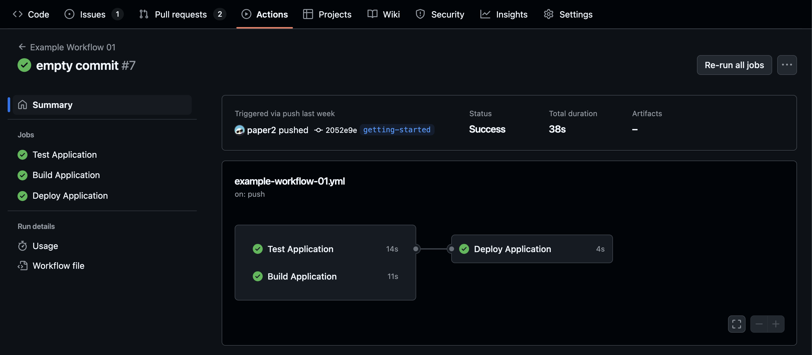
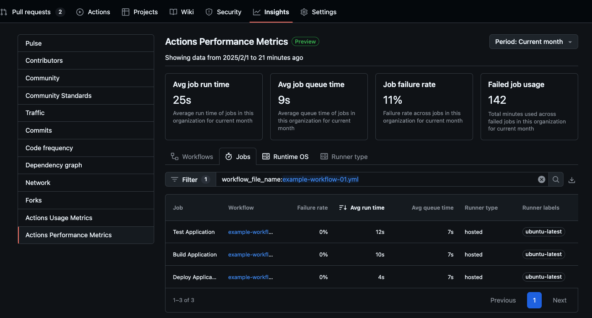
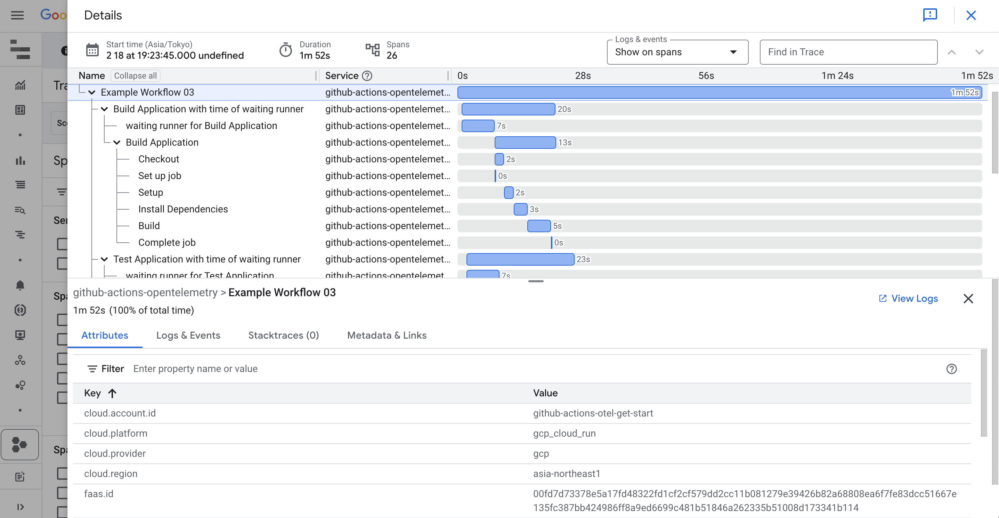
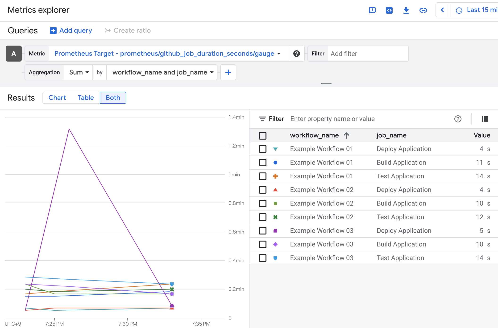
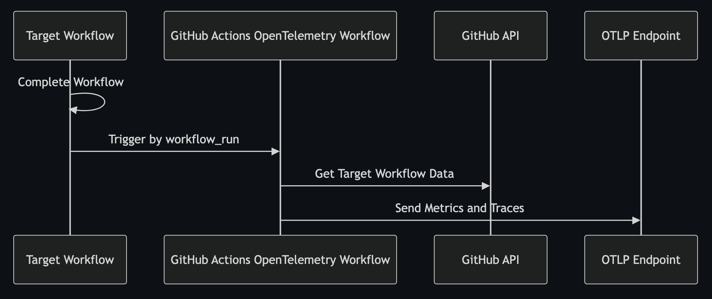

GitHub Actionsは、リポジトリ内のコードをビルド・テスト・デプロイするCI/CDワークフローなどを手軽に構築できるサービスです。
しかし、そのワークフロー実行時間の詳細な可視化や、変更による効果測定には工夫が必要です。
この記事では、OpenTelemetryを活用してGitHub Actionsの実行状況をトレースとメトリクス化する[GitHub Actions OpenTelemetry](https://github.com/marketplace/actions/github-actions-opentelemetry)を紹介します。
これにより、どのステップに時間がかかっているか、改善施策の効果がどの程度あったのかなどを把握しやすくなります。

[alt text](image-2.png)

[:contents]

# GitHub Actionsにおける課題

## ワークフローの実行結果を視覚的に確認する方法が提供されていない

GitHub Actionsではサマリー機能によりジョブの実行時間や依存関係などの概要を確認することができます。



一方で各ステップの実行時間やエラーの発生箇所など、より詳細な情報を把握するためには、ジョブのログを手動で確認する必要があります。単純なワークフローであれば大きな問題はありませんが、ステップ数が多い場合や複数のジョブを持つワークフローの場合、手動でログを確認するのは手間がかかります。

## ワークフローの変更による影響を分析しづらい

GitHubからはActions metricsが提供されており、失敗率や平均実行時間は参照できます。



しかし、ワークフローの変更による影響を定量的に確認する上では施策導入前後の比較や平均以外の統計値（パーセンタイルなど）を把握したい場合も多いです。現状では、これらの情報を取得するためには、GitHub ActionsのAPIを利用して自前で集計する必要があります。

# GitHub Actions OpenTelemetryとは

## 概要と基本的な機能

[GitHub Actions OpenTelemetry](https://github.com/marketplace/actions/github-actions-opentelemetry)は、GitHub Actionsのワークフロー、ジョブ、ステップの結果を収集し、トレースとメトリクスをOpenTelemetry Protocol（OTLP）エンドポイントに送信する仕組みを提供します。主な機能は以下のとおりです。

- GitHub Actionsのワークフローとジョブ実行時間のメトリクスを収集
- GitHub Actionsのワークフロー、ジョブ、ステップのトレースを収集
- OTLP互換のバックエンドにデータを送信し、モニタリングと観測が可能
- 既存のワークフローに手を加えることなく、テレメトリを収集することが可能

GitHub Actions OpenTelemetryにより、ワークフローの実行状況をトレースやメトリクスとして可視化でき、ボトルネックやエラー箇所を特定しやすくなります。
また、施策前後の効果測定が容易になり、改善の優先度付けやROIを定量的に示せるようになります。

## OpenTelemetryとは

OpenTelemetryは、トレースやメトリクス、ログなどのテレメトリーデータを生成・管理するためのオープンソースのフレームワークです。
ベンダーロックインを排除し、JaegerやPrometheusなどのさまざまなツールやサービスと連携可能です。
そのため、GitHub Actions OpenTelemetryを利用することで、自分好みの監視基盤にシームレスに統合できます。

# 導入方法

GitHub Actions OpenTelemetryの導入は比較的シンプルで、下記のサンプルワークフローを参考に導入できます。

## **OTLPエンドポイントの準備**

JaegerやPrometheusなどのOTLP互換バックエンドを用意しておき、テレメトリーデータを受信できる状態にします。

OpenTelemetryを利用していない方向けにGoogle Cloud上でのOTLPエンドポイントの構築を含めた[Getting Started](https://github.com/paper2/github-actions-opentelemetry/blob/main/examples/google-cloud/README.md)も用意していますので、適宜参照してください。

## **GitHub Actions Workflowの作成**

[workflow_run](https://docs.github.com/en/actions/writing-workflows/choosing-when-your-workflow-runs/events-that-trigger-workflows#workflow_run)イベントを使用し、完了したワークフローからメトリクスやトレースを収集するためのワークフローを新たに作成します。最小限の設定とサンプルワークフローを以下に示します。

```yaml
name: Send Telemetry after Other Workflow

on:
  workflow_run:
    # 監視対象にしたいワークフロー名を指定
    workflows:
      - Check Transpiled JavaScript
      - Continuous Integration
      - CodeQL
      - Lint Codebase
    # このアクションはトレースとメトリクスを作成するために完了したワークフローを使用します。
    types:
      - completed

permissions:
  # プライベートリポジトリの場合は必要です。
  actions: read

jobs:
  send-telemetry:
    name: Send CI Telemetry
    runs-on: ubuntu-latest
    steps:
      - name: Run
        id: run
        uses: paper2/github-actions-opentelemetry@main
        env:
          OTEL_SERVICE_NAME: github-actions-opentelemetry
          OTEL_EXPORTER_OTLP_ENDPOINT: https://collector-example.com
          # JP: ヘッダーを追加できます。OTLPエンドポイントの認証に活用できます。
          # 例：
          # New Relic: api-key=YOUR_NEWRELIC_API_KEY
          # Google Cloud Run: Authorization=Bearer <value of $(gcloud auth print-identity-token)>
          OTEL_EXPORTER_OTLP_HEADERS:
            api-key=${ secrets.API_KEY },other-config-value=value
        with:
          # トークンはワークフローのデータを収集する際に利用します。
          GITHUB_TOKEN: ${{ secrets.GITHUB_TOKEN }}
```

このように設定すると、指定したワークフローが完了したタイミングで、自動的にその実行結果のメトリクスやトレース情報がOTLPエンドポイントに送られます。

その他の詳細な設定については、[GitHub Actions OpenTelemetryのリポジトリ](https://github.com/paper2/github-actions-opentelemetry/tree/main?tab=readme-ov-file#configuration)を参照してください。他にもメトリクスのみ、トレースのみの機能を有効化することも可能です。

以下にトレースやメトリクスをGoogle Cloudに送った際のサンプル画像を示します。




もちろん、OTLPエンドポイントを受け付けることができれば他のツールやサービスにもデータを送信し、可視化や分析を行うことが可能です。

# ユースケース

## 改善点の特定

GitHub Actionsのワークフローは、複数のジョブやステップから構成されることが一般的です。
ワークフロー全体の実行時間をトレースやメトリクスとして可視化することで、どのステップに時間がかかっているかを把握しやすくなります。
例えば、ビルドやテストに時間がかかっている場合、そのステップの並列化やキャッシュ導入などの改善施策を検討することができます。

また、日々の実行結果をメトリクスとして記録しておくことで、ワークフローの実行時間の変動から異常な処理の混入などにも気付きやすくなります。

## 改善における効果測定

改善を実施した場合に、実際にどれだけの効果があったのかを定量的に把握することにも活用できます。

私は業務でビルドキャッシュの導入によるビルド時間の短縮効果を測定するためにGitHub Actions OpenTelemetryを利用しました。

職場のリポジトリはモノレポ構成のため、同じワークフローでマトリックスストラテジーにより、複数マイクロサービスのジョブが実行されます。まずは小さく始めるため、一つのサービスにビルドキャッシュを導入し、その効果を測定したいと考えていました。しかし、特定のジョブの実行時間を把握するためには、ログを手動で確認する必要があり、手間がかかると感じていました。

そこで、GitHub Actions OpenTelemetryを導入し、ビルドキャッシュ導入前後の実行時間をメトリクスとして記録しました。その結果、リリース時の特定ジョブの実行時間を70%削減できることがわかりました。その結果を元に、現在他のサービスへのビルドキャッシュ導入を展開しています。

# 仕組み

簡単に仕組みも説明します。以下がシーケンシャル図です。



GitHub Actions OpenTelemetryはGitHub APIを使って、完了したワークフローやジョブのデータを収集し、OTLP互換のエンドポイントに送信します。

OpenTelemetryではリアルタイムにテレメトリを生成する利用が一般的ですが、GitHub Actions OpenTelemetryでは完了したワークフローの情報をもとにテレメトリをバッチ的に生成するというアプローチをとっています。

そうすることにより、既存のワークフローの各ジョブでテレメトリを生成する処理などを追加する必要がなく、独立してテレメトリを収集することができます。もし各ジョブでテレメトリを生成する場合、その処理を既存のワークフローに埋め込む方法を考える必要があります。GitHub Actions OpenTelemetryでは既存のワークフローに手を加えることなく、テレメトリを収集することができるため、導入が容易です。

# まとめ

[GitHub Actions OpenTelemetry](https://github.com/marketplace/actions/github-actions-opentelemetry)は、GitHub Actionsのワークフロー、ジョブ、ステップの結果を収集し、トレースとメトリクスをOpenTelemetry Protocol（OTLP）エンドポイントに送信する仕組みを提供します。主な機能は以下のとおりです。

- GitHub Actionsのワークフローとジョブ実行時間のメトリクスを収集
- GitHub Actionsのワークフロー、ジョブ、ステップのトレースを収集
- OTLP互換のバックエンドにデータを送信し、モニタリングと観測が可能
- 既存のワークフローに手を加えることなく、テレメトリを収集することが可能

これにより、ワークフローの実行状況をトレースやメトリクスとして可視化でき、ボトルネックやエラー箇所を特定しやすくなります。また、施策前後の効果測定が容易になり、改善の優先度付けやROIを定量的に示せるようになります。

GitHub Actionsの可視化や分析にお悩みの方は、ぜひ「GitHub Actions OpenTelemetry」を検討してみてください。
GitHub Actions OpenTelemetryの概要と導入方法、さらにユースケースなどを紹介しました。
ワークフローの現状を可視化し、より効率的な開発と高品質なリリースを目指す方の参考になれば幸いです。