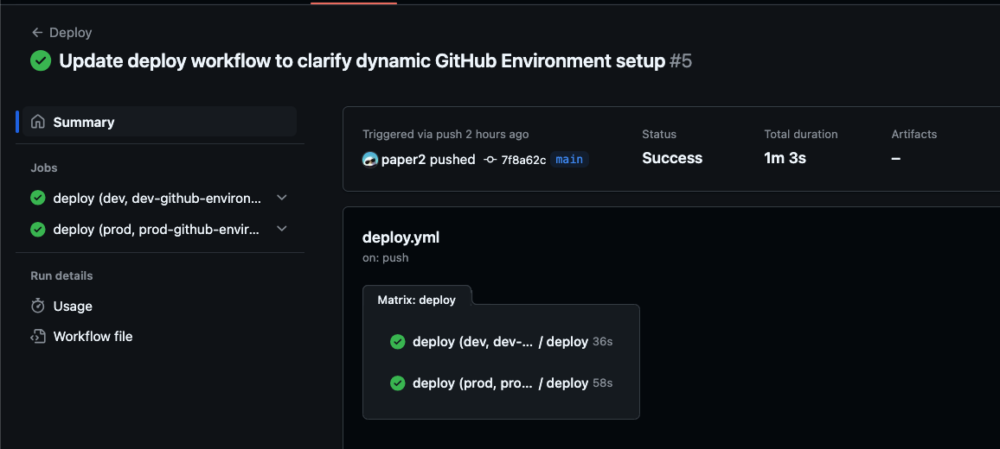
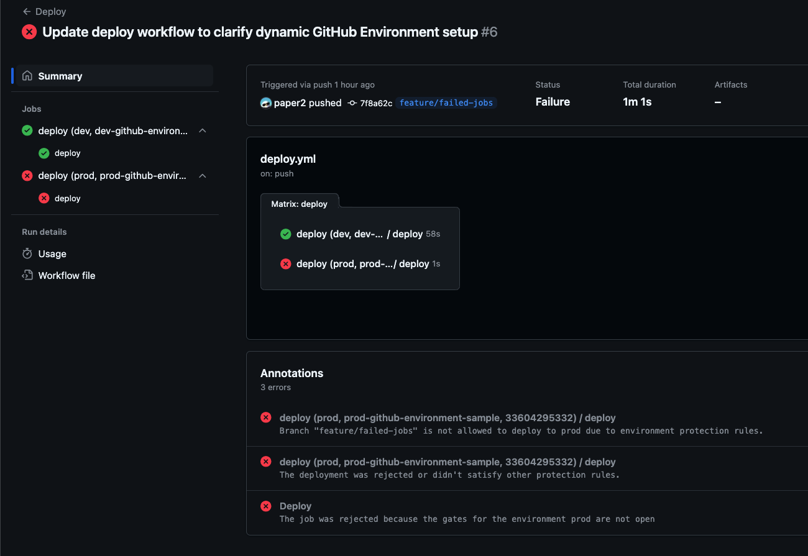

# GitHub EnvironmentsでGoogle Cloudの本番権限を制限する

GitHub ActionsにGoogle Cloudの権限を付与することは多いと思います。その際に、本番環境にアクセスできる権限を制限することはセキュリティ上重要です。

本記事では、その重要性を説明した上で具体的に[GitHub Environments](https://docs.github.com/en/actions/managing-workflow-runs-and-deployments/managing-deployments/managing-environments-for-deployment)を利用して、GitHub Actionsに付与するGoogle Cloudの権限を制御する方法をTerraformのコードと共に紹介します。

[:contents]

# 権限を制限しないリスク
- GitHub Actionsの権限を制限しない場合、リポジトリ内のコードを書き換えるだけで、本番環境にアクセスできるようになる
- カスタムGitHub Actionの検証などで、開発者が意図せず悪意のあるコードを実行してしまった場合に、本番環境にアクセスされる

# 対策例
- 特定EnvironmentにのみGoogle Cloudの本番の権限を付与する <- 本記事の対象
  - 例えばproduction EnvironmentにのみGoogle Cloudの本番の権限を付与する
- 特定Environmentの操作のレビューを必須にする
  1. dispatch_workflowの承認を利用する方法
     - [GitHub Actions の environments を使ってデプロイ時に承認プロセスを導入する](https://zenn.dev/ore88ore/articles/github-actions-approval-flow)
  2. protected branchを併用する方法
     - Environmentの機能でmainブランチのみでしか利用できないようにする
        - [[GitHub Actions] ブランチごとにジョブの実行を制御できる Environments を試してみた | DevelopersIO](https://dev.classmethod.jp/articles/github-actions-environment-secrets-and-environment-variables/)
     - mianマージに厳格なレビューが必須となる仕組みを作る
     - production Environmentをmainブランチのみで利用できるようにする

# 権限を制限する方法

GitHub Environmentsを利用して、GitHub Actionsに付与するGoogle Cloudの権限を制限する方法サンプルも交えて説明します。

サンプルとしてdevとprodの２つの環境を作成し、Cloud Runのデプロイを行います。prod環境はmainブランチのみでデプロイ可能にします。

サンプルコードは以下のリポジトリにあります。

https://github.com/paper2/google-cloud-restricts-github-actions-sample

## GitHub Environmentsの作成

各環境ごとにGitHub Environmentsを作成します。
作成方法の詳細は[公式ドキュメント](https://docs.github.com/en/actions/managing-workflow-runs-and-deployments/managing-deployments/managing-environments-for-deployment#creating-an-environment)を参照してください。

今回のサンプルではdevとprodの２つの環境を作成します。devはデフォルトの設定で作成し、prodはmainブランチのみで利用可能に設定します。

本番の設定img

最終的に以下のようにEnvironmentsが作成されます。

img

## Direct Workload Identity Federationの設定

各環境ごとにGoogle Cloudのプロジェクトに対してDirect Workload Identity FederationをTerraformで設定します。

Direct Workload Identity Federationの説明は本記事では割愛しますが、詳細は以前書いた以下の記事を参照してください。

https://paper2.hatenablog.com/entry/2024/06/29/143947?_gl=1*11p0afo*_gcl_au*MTEwNDkxOTU4Mi4xNzM1MDgxOTky


```hcl
locals {
  repository = "paper2/google-cloud-restricts-github-actions-sample"
}

resource "google_iam_workload_identity_pool" "github_actions_pool" {
  project                   = var.project
  workload_identity_pool_id = "github-actions-pool"
  display_name              = "github-actions-pool"
  description               = "Workload Identity Pool for GitHub Actions"
  disabled                  = false
}

resource "google_iam_workload_identity_pool_provider" "github_actions_workflow_pool_provider" {
  project                            = var.project
  workload_identity_pool_id          = google_iam_workload_identity_pool.github_actions_pool.workload_identity_pool_id
  workload_identity_pool_provider_id = "github-actions-provider"
  display_name                       = "github-actions-provider"
  description                        = "Workload Identity Pool Provider for GitHub Actions"
  disabled                           = false
  attribute_condition                = "'${local.repository}' == attribute.repository"
  attribute_mapping = {
    "google.subject"       = "assertion.sub"
    "attribute.repository" = "assertion.repository"
  }
  oidc {
    issuer_uri = "https://token.actions.githubusercontent.com"
  }
}
```

## 各Environmentに対するIAMの設定

各GitHub Environmentsに対してIAMの設定を行います。github_actions_principalがGitHub Actionsのプリンシパルになります。本記事のポイントのため、詳細を後述します。

```hcl
locals {
  repository = "paper2/google-cloud-restricts-github-actions-sample"
  // In the case of Direct Workload Identity Federation, you need to specify the subject if you are using `Environment`
  github_actions_principal = "principal://iam.googleapis.com/${google_iam_workload_identity_pool.github_actions_pool.name}/subject/repo:${local.repository}:environment:${var.environment}"
}

resource "google_project_iam_member" "github_actions" {
  project = var.project
  // lists of roles to be granted to the member
  for_each = toset([
    "roles/run.developer"
  ])
  role   = each.value
  member = local.github_actions_principal
}

data "google_compute_default_service_account" "default" {}
// Grant the default service account the ability to impersonate the GitHub Actions principal for deployments of cloud run services.
resource "google_service_account_iam_member" "default-account" {
  service_account_id = data.google_compute_default_service_account.default.name
  role               = "roles/iam.serviceAccountUser"
  member             = local.github_actions_principal
}
```

github_actions_principalにはWorkload Identityのプールとsubjectを指定しています。このsubjectの部分が重要です。

```txt
subject/repo:${local.repository}:environment:${var.environment}
```

subjectはGitHub Actionsから送られてくる情報で、これを元にIAMの権限付与を行います。repoはリポジトリ名、environmentはGitHub Environmentsの名前です。

GitHub Environmentsを利用する場合、subjectにenvironmentが必ず含まれる仕様となっています。この仕様により、特定のGitHub Environmentにのみ権限を付与することが可能になります。

## GitHub Actionsの設定

GitHub Actionsではreusable workflowを利用して、devとprodの環境に対してデプロイを行っています。そのため、ワークフローのファイルは２つに分かれています。

処理としては単純で、各環境でGoogle CloudにDirect Workload Identity Federationで認証し、Cloud Runをデプロイしているだけです。

**deploy.yml**

```yaml
name: Deploy 

on:
  push:

jobs:
  deploy:
    strategy:
      fail-fast: false
      matrix:
        environments: [ 
          {
            environment: dev,
            project-id: dev-github-environment-sample,
            project-number: 901270760711
          },
          {
            environment: prod,
            project-id: prod-github-environment-sample,
            project-number: 33604295332
          }
        ]
    uses: ./.github/workflows/_deploy.yml
    permissions:
      contents: 'read'
      id-token: 'write'
    with:
      project-id: ${{ matrix.environments.project-id }}
      project-number: ${{ matrix.environments.project-number }}
      environment: ${{ matrix.environments.environment }}
```

**_deploy.yml**

```yaml
name: Deploy to Cloud Run
on:
  workflow_call:
    inputs:
      project-id:
        required: true
        type: string
      project-number:
        required: true
        type: number
      environment:
        required: true
        type: string

jobs:
  deploy:
    # Set GitHub Environment dynamically by using the reusable workflow
    environment: ${{ inputs.environment }}
    runs-on: ubuntu-latest
    permissions:
      contents: 'read'
      id-token: 'write'
    steps:
      - uses: actions/checkout@11bd71901bbe5b1630ceea73d27597364c9af683 # v4.2.2
      - name: Authenticate to Google Cloud
        uses: google-github-actions/auth@6fc4af4b145ae7821d527454aa9bd537d1f2dc5f # v2.1.7
        with:
          project_id: ${{ inputs.project-id }}
          workload_identity_provider: projects/${{ inputs.project-number }}/locations/global/workloadIdentityPools/github-actions-pool/providers/github-actions-provider
      - name: Install the Cloud SDK
        uses: google-github-actions/setup-gcloud@6189d56e4096ee891640bb02ac264be376592d6a # v2.1.2
      - name: Deploy
        run: gcloud run deploy sample --image us-docker.pkg.dev/cloudrun/container/hello:latest --project ${{ inputs.project-id }} --platform managed --region us-central1
```

`_deploy.yml`ではGitHub Environmentsを以下のように指定しています。動的に設定するためにはreusable workflowを利用する必要があります。

```yaml
    environment: ${{ inputs.environment }}
```

environmentを指定しない場合、IAMの権限が付与されないためデプロイが失敗します。


## ワークフローを実行

今回はpushをトリガーとしているため、mainブランチにコミットしてpushすると、GitHub Actionsが実行されます。また、mainブランチ以外でprodを利用できないことを確認するために、main以外のブランチでのpushも行います。


