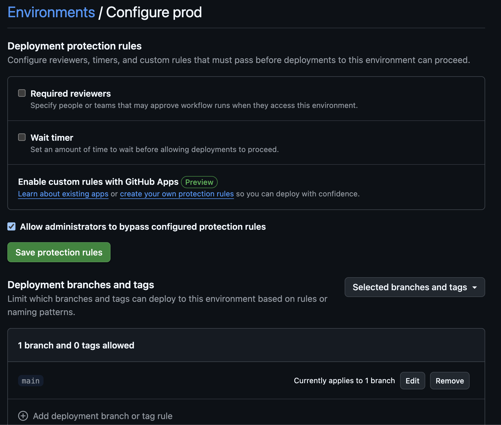

# GitHub EnvironmentsでGoogle Cloudの本番権限を制限する

GitHub ActionsにGoogle Cloudの権限を付与することは多いですが、本番環境へ不要なアクセスを防ぐため、権限の制限はセキュリティ上非常に重要です。  
本記事では、**GitHub Environments**を利用して、GitHub Actionsに付与するGoogle Cloudの権限を環境ごとに制御する方法を、Terraformコードと共に具体的に紹介します。

[:contents]

# 権限を制限しないリスク

本番環境は顧客の大切なデータやサービスが格納されているため、アクセス権限を適切に制御することが基本です。  
GitHub Actionsに対して本番権限を制限しない場合、以下のようなリスクが考えられます。

- **意図しないコード実行による被害**  
  カスタムGitHub Actionの検証などで、開発者が誤って悪意のあるコードを実行してしまった場合、本番環境にアクセスされるリスクがある。

- **内部不正**  
  リポジトリ内のコードを書き換えるだけで、本番環境にアクセスできる状態になってしまい、開発者の悪意による被害が発生する可能性がある。

# 対策例

以下の両方の対応をすることで対策が可能です。

- 特定のGitHub EnvironmentにのみGoogle Cloudの本番権限を付与する
- そのGitHub Environmentの変更のレビューを必須にする

本記事では情報が少ない前者の方法について詳しく説明します。後者の方法は複数の選択肢があると共に、良い記事があるため、本記事では以下の折りたたみで簡単にふれる程度にとどめます。

<details>
<summary>GitHub Environmentの変更のレビューを必須にする方法</summary>

1. dispatch_workflowの承認を利用する方法
    - 参考：[GitHub Actions の environments を使ってデプロイ時に承認プロセスを導入する](https://zenn.dev/ore88ore/articles/github-actions-approval-flow)
    - ただし、privateリポジトリではGitHub Enterpriseなどのプランが必要になります
2. [Protected Branches](https://docs.github.com/en/repositories/configuring-branches-and-merges-in-your-repository/managing-protected-branches/about-protected-branches)を併用する方法
    - GitHub Environmentsの機能でmainブランチのみでしか利用できないようにする
      - 参考：[[GitHub Actions] ブランチごとにジョブの実行を制御できる Environments を試してみた | DevelopersIO](https://dev.classmethod.jp/articles/github-actions-environment-secrets-and-environment-variables/)
    - mianのマージにレビューが必須となるようにProtected branchを設定する

</details>

# 権限を制限する方法

以下では、GitHub Environmentsを利用して、GitHub Actionsに対するGoogle Cloudの権限を制御する手法を、具体例とサンプルコードと共に紹介します。  
サンプルとして、**dev** と **prod** の2つの環境を用意し、Cloud Runのデプロイを行います。  
なお、prod環境は**mainブランチ**のみでデプロイ可能とし、意図しないアクセスを防止します。  
詳細なサンプルコードは以下のリポジトリで確認できます。  
[https://github.com/paper2/google-cloud-restricts-github-actions-sample](https://github.com/paper2/google-cloud-restricts-github-actions-sample)


## GitHub Environmentsの作成

まずは各環境ごとにGitHub Environmentsを作成します。
作成方法の詳細は[公式ドキュメント](https://docs.github.com/en/actions/managing-workflow-runs-and-deployments/managing-deployments/managing-environments-for-deployment#creating-an-environment)を参照してください。

今回のサンプルでは、以下の2つの環境を作成します。

| GitHub Environments名 | デプロイ許可     |
| --------------------- | ---------------- |
| dev                   | すべてのブランチ |
| prod                  | mainブランチのみ |

`dev`はデフォルト設定で作成し、`prod`では以下のようにDeployment Branchesを`main`に設定します。



## Direct Workload Identity Federationの設定

各環境ごとにGoogle Cloudで、**Direct Workload Identity Federation**の設定を作成します。
Direct Workload Identity Federationは、GitHub Actionsからの認証に必要な仕組みですが、ここでは詳細な解説は省略し、以前執筆した[記事](https://paper2.hatenablog.com/entry/2024/06/29/143947?_gl=1*11p0afo*_gcl_au*MTEwNDkxOTU4Mi4xNzM1MDgxOTky)を参考にしてください。

以下は、Terraformコードの一例です。

```hcl
locals {
  repository = "paper2/google-cloud-restricts-github-actions-sample"
}

resource "google_iam_workload_identity_pool" "github_actions_pool" {
  project                   = var.project
  workload_identity_pool_id = "github-actions-pool"
  display_name              = "github-actions-pool"
  description               = "Workload Identity Pool for GitHub Actions"
  disabled                  = false
}

resource "google_iam_workload_identity_pool_provider" "github_actions_workflow_pool_provider" {
  project                            = var.project
  workload_identity_pool_id          = google_iam_workload_identity_pool.github_actions_pool.workload_identity_pool_id
  workload_identity_pool_provider_id = "github-actions-provider"
  display_name                       = "github-actions-provider"
  description                        = "Workload Identity Pool Provider for GitHub Actions"
  disabled                           = false
  attribute_condition                = "'${local.repository}' == attribute.repository"
  attribute_mapping = {
    "google.subject"       = "assertion.sub"
    "attribute.repository" = "assertion.repository"
  }
  oidc {
    issuer_uri = "https://token.actions.githubusercontent.com"
  }
}
```

## 各Environmentに対するIAMの設定

次に、各GitHub Environmentに対してIAMの設定を行います。  
GitHub Actionsの認証に用いるプリンシパル（ここでは`github_actions_principal`）に対し、必要なロール（例：Cloud Run Developer）を付与します。

```hcl
locals {
  repository = "paper2/google-cloud-restricts-github-actions-sample"
  // Direct Workload Identity Federation利用時、Environmentを利用する場合はsubjectを指定する必要があります
  github_actions_principal = "principal://iam.googleapis.com/${google_iam_workload_identity_pool.github_actions_pool.name}/subject/repo:${local.repository}:environment:${var.environment}"
}

resource "google_project_iam_member" "github_actions" {
  project = var.project
  // 付与するロールのリスト
  for_each = toset([
    "roles/run.developer"
  ])
  role   = each.value
  member = local.github_actions_principal
}

data "google_compute_default_service_account" "default" {}
// Cloud Runのデプロイで、デフォルトのサービスアカウントがGitHub Actionsプリンシパルを扱えるように設定
resource "google_service_account_iam_member" "default-account" {
  service_account_id = data.google_compute_default_service_account.default.name
  role               = "roles/iam.serviceAccountUser"
  member             = local.github_actions_principal
}
```

上記設定では、`github_actions_principal`のsubjectにリポジトリ名とEnvironment名を含めています。  
この仕様により、特定のGitHub Environmentにのみ権限を付与することが可能となります。

## GitHub Actionsの設定

GitHub Actionsでは、**reusable workflow**を利用して、devおよびprod環境に対してデプロイを実行します。  
ワークフローはreusable workflowを利用しているため大きく2つのファイルに分かれています。以下にサンプルコードを示します。

### deploy.yml

```yaml
name: Deploy 

on:
  push:

jobs:
  deploy:
    strategy:
      fail-fast: false
      matrix:
        environments: [ 
          {
            environment: dev,
            project-id: dev-github-environment-sample,
            project-number: 901270760711
          },
          {
            environment: prod,
            project-id: prod-github-environment-sample,
            project-number: 33604295332
          }
        ]
    uses: ./.github/workflows/_deploy.yml
    permissions:
      contents: 'read'
      id-token: 'write'
    with:
      project-id: ${{ matrix.environments.project-id }}
      project-number: ${{ matrix.environments.project-number }}
      environment: ${{ matrix.environments.environment }}
```

### _deploy.yml

```yaml
name: Deploy to Cloud Run
on:
  workflow_call:
    inputs:
      project-id:
        required: true
        type: string
      project-number:
        required: true
        type: number
      environment:
        required: true
        type: string

jobs:
  deploy:
    # GitHub Environmentを動的に設定するため、reusable workflowを活用
    environment: ${{ inputs.environment }}
    runs-on: ubuntu-latest
    permissions:
      contents: 'read'
      id-token: 'write'
    steps:
      - uses: actions/checkout@11bd71901bbe5b1630ceea73d27597364c9af683 # v4.2.2
      - name: Authenticate to Google Cloud
        uses: google-github-actions/auth@6fc4af4b145ae7821d527454aa9bd537d1f2dc5f # v2.1.7
        with:
          project_id: ${{ inputs.project-id }}
          workload_identity_provider: projects/${{ inputs.project-number }}/locations/global/workloadIdentityPools/github-actions-pool/providers/github-actions-provider
      - name: Install the Cloud SDK
        uses: google-github-actions/setup-gcloud@6189d56e4096ee891640bb02ac264be376592d6a # v2.1.2
      - name: Deploy
        run: gcloud run deploy sample --image us-docker.pkg.dev/cloudrun/container/hello:latest --project ${{ inputs.project-id }} --platform managed --region us-central1
```

`_deploy.yml`では、`environment`を`${{ inputs.environment }}`として指定している点に注目してください。  
この設定により、該当のGitHub Environmentに対してのみIAMの権限が適用され、意図しない環境でのデプロイが防止されます。

## ワークフローの実行

今回のワークフローは、pushをトリガーとして実行されます。  
以下の点を確認します。

- **mainブランチの場合**  
  - devおよびprodの両方の環境で正常にデプロイが実行される。
>   
  
- **mainブランチ以外の場合**  
  - prod環境へのデプロイは、GitHub Environmentの設定により権限が付与されず、実行に失敗する。

> 

---

## 9. まとめ

本記事では、GitHub Environmentsを活用して、GitHub Actionsに付与するGoogle Cloudの権限を環境ごとに制御する方法を解説しました。  

- **リスクの把握:** 権限を制限しない場合、意図しないコード実行や内部不正によるリスクが存在する。  
- **対策:** 特定のGitHub Environmentにのみ本番権限を付与し、さらに変更承認プロセスを導入する。  
- **実装例:** TerraformによるDirect Workload Identity Federation設定、各EnvironmentごとのIAM設定、そしてGitHub Actionsのreusable workflowを用いたデプロイ方法を具体的に示した。

この仕組みにより、開発者やCI/CDパイプラインからのアクセスを厳密に制御でき、セキュリティレベルの向上が期待できます。  
