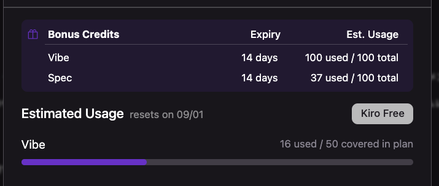
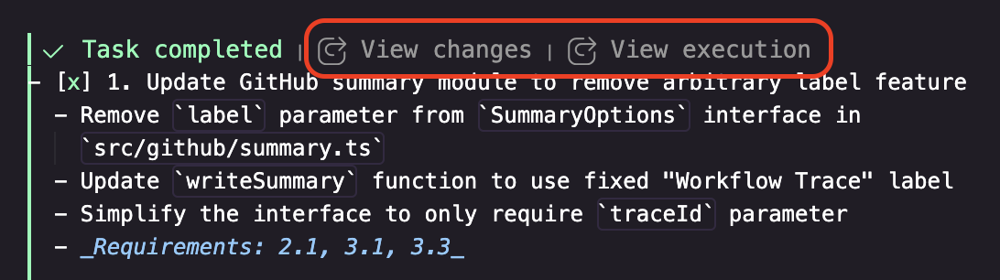
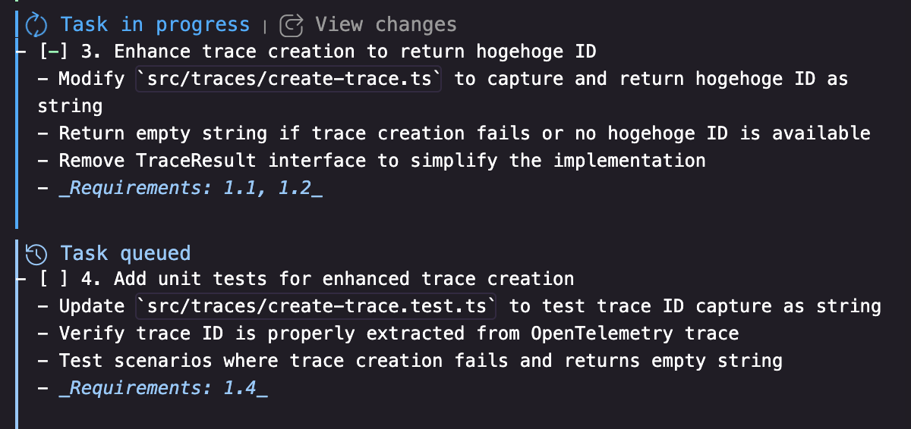
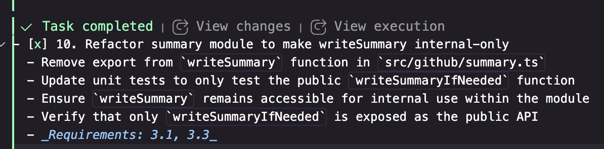
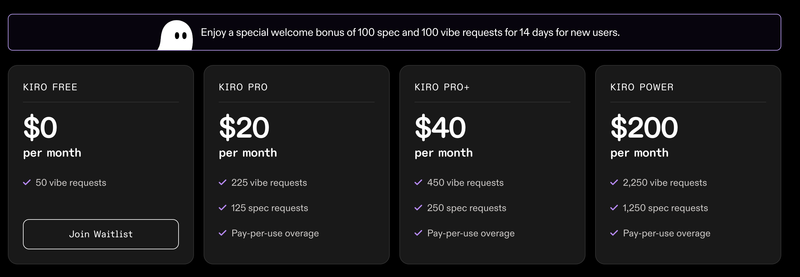
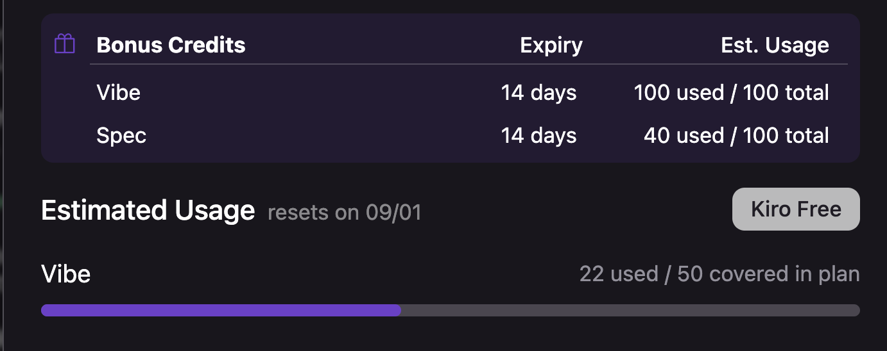

# Kiroの良いところを伝えたい

生成AIに適切なコンテキストを渡す仕組みを作りたいけど、あまり手を出せていない人は多いのではないでしょうか。私もその一人で、そんな私にとってKiroはかなり衝撃的なプロダクトでした。

無料枠で色々学ばせてもらった感謝の気持ちを込めてKiroの良いところをお伝えしたいと思います。

[:contents]

## Kiroが提供するコアソリューション

仕様駆動開発（spec-driven development）は[Kiroの重要なコンセプト](https://kiro.dev/docs/specs/concepts)です。

要件（requirements）、構造化された設計（designs）、実装タスク（tasks）を生成AIを活用して作成、管理し、熟練の開発者が行なっているプラクティスを多くの人が効率的に行えるようにします。

個人的にはKiroの最大の価値は、仕様駆動開発のワークフローを、フレームワークとして提供していることだと考えています。さらに各工程をシームレスにサポートする機能はとても強力だと感じています。

### 構造化されたドキュメント管理

Kiroでは、以下の3つのファイルが中核となります：

- 要件（requirements.md） - 構造化された EARS 記法でユーザーストーリーと受入基準を記述
- 設計（design.md） - テクニカルアーキテクチャ、シーケンス図、実装に関する考慮事項を記述
- タスク（tasks.md） - 個別の追跡可能なタスクによる詳細な実装計画を記述


これらが単なる独立したドキュメントではなく、相互に依存関係を持つ構造化された情報として管理され続けます。

例えば、以下はtasks.mdの例ですが、最後に要件（requirements.md）の何番に対応するかが記載されており、構造的なドキュメントの依存が管理されていることがわかります。

```markdown
- [x] 1. Update GitHub summary module to remove arbitrary label feature
  - Remove `label` parameter from `SummaryOptions` interface in
    `src/github/summary.ts`
  - ...
  - _Requirements: 2.1, 3.1, 3.3_
```

作成もふんわりした機能の説明から要件ファイルが作成され、それをベースに詳細を詰めていきます。それをインプットに設計、またそれをインプットにタスクのファイルを作成します。

今回Kiroの検証で実際に作成したドキュメントのリンクを参考までに以下に記載します。どんなのができるか興味があれば見てみてください。

- [requirements.md](https://github.com/paper2/github-actions-opentelemetry/blob/main/.kiro/specs/trace-id-summary/requirements.md)
- [design.md](https://github.com/paper2/github-actions-opentelemetry/blob/main/.kiro/specs/trace-id-summary/design.md)
- [tasks.md](https://github.com/paper2/github-actions-opentelemetry/blob/main/.kiro/specs/trace-id-summary/tasks.md)


### 高速な試行錯誤サイクルの実現

初期の要件や設計が完璧であることは稀です。むしろ、試行錯誤を通じて最適解を見つけていくプロセスが重要です。

Kiroにより要件、設計、タスクを頻繁に修正することができて、試行錯誤を高速に回すことができるのがメリットだと感じています。

個人的にはその体験をしっかり考え抜いた機能が多く実装されていると感じました。当社でも「体験を想像する」ことを重要視しているのですが、そのマインドを感じてプロダクトとしてはとても好印象です。

次にそれらのマインドを感じた細かい体験、機能をいくつかご紹介します。

## 良かった体験

### 実装時の設計変更提案

実装の修正指示の内容から要件の変更に結びつきそうな場合はそれを提案してくれる機能がありました。それにより、要件や設計からまた練り直してタスクを再作成するというフローがシームレスにできます。

これにより実装レベルの気づきをドキュメントに反映でき、実装との乖離を防止できます。

### 専用タブによる効率的なドキュメント参照

仕様駆動開発では、要件、設計、タスクのファイルを頻繁に参照します。Kiroでは、これらのファイル用の専用タブが用意されており、ワンクリックでアクセスできます。



このタブがあることでぱっぱと確認できるのは意外と大きいメリットかなと感じました。こういう細かい機能の積み重ねが大きく効率を上げるように感じています。

### タスク管理と変更履歴の追跡

完了したタスク実行における変更差分と、タスク実行時のセッションに飛べる機能があります。



これによりタスクがどのような経緯で変更されたかを追跡でき、実装時の判断根拠を後から確認でき、デバッグ時の原因調査が効率化されるなど多くの利点があると感じました。

タスクは同時に1個しか実行できない仕様ですが、実行待ちが設定できるのも良いです。一気にここは作っちゃおうというタスクは一気に作れます。



### 開発プロセスの可視化

開発の中で考えていることがドキュメントとして残るのはやはりいいなぁと思いました。これにより後から「なぜこの設計にしたのか」を振り返ることができ、チームメンバーとの知識共有が容易になり、類似プロジェクトでの参考資料として活用できるなど多くのメリットがあると思います。

また、それをベースとして要件を変更したら設計が、設計を変更したらタスクが変わるという依存関係で常に管理し続けることにとてもメリットを感じます。それがあることによって、各変更を記録しながら、今までの変更内容を加味した修正等が行えると感じました。

またリファクタリングなどの経緯も残せます。下記は実際に機能ができた後にリファクタリングした時のタスクです。



### コンテキスト管理の最適化

Kiroは、大きなコンテキストを含まないように、毎回必要な情報だけを読み取ってセッションを実行する設計になっていそうです。

細かいセッションが区切れる設計になっていて、例えば、タスクを実行するごとに新しいセッションが開かれ、今まで作成した要件、設計、タスクのファイルが読み込まれます。

生成AIはコンテキストが膨らむとバカになるというのは有名な話ですが、仕様駆動開発で実装に必要な情報を構造的に管理することで最低限のインプットにすることが可能となるため、実装の精度も上がるのではないかと感じました。

## 現時点での制約

現時点では足りていない機能も多いと感じました。例えば、[Devcontainerが利用できない](https://github.com/kirodotdev/Kiro/issues/164)のと、Web検索機能をしてくれないのは開発中にかなり不便を感じました。

ただ、まだ新しいプロダクトなので、今後の機能追加ですぐ利用できるようになるでしょう。

## 料金モデルについての率直な所感

Kiroのコアバリューは仕様駆動開発の効率化にあると感じています。この価値は確実に存在し、実際に体験してみると大きなメリットを感じます。

しかし、料金面はプロダクトとして心配です。以下が現在公開されている料金プランです。



vibeリクエストは作業時のプロンプト実行、specリクエストは要件、設計、タスクの更新時のプロンプト実行時に消費されます。

今回ボーナスで 150 vibe, 100 specリクエストもらいましたが、[GitHub ActionsのTrace IDをサマリに表示するちょっとした機能](https://github.com/paper2/github-actions-opentelemetry/pull/157)を実装してvibeリクエストは使い切ってしまうくらいでした。



現状毎月$20払って225 vibe、125 specリクエストしか使えないので全然開発するのに足りない印象です。他のプロダクトが安すぎるという面もありますが、ユーザーとしては抵抗を感じる価格帯です。

Kiroは内部で外部ベンダーのAI APIを利用するモデルです。このモデルで利益を出そうとするとAPI利用コストに加えてマージンが必要で、結果として他の直接利用サービスより高額になり、採算を取るのがかなり難しいのだろうなと推測しています。

素晴らしいプロダクトですが、このままの料金体系で大丈夫なのかという不安を感じました。

## コアソリューションを他の安価なサービスに実現される可能性

細かな体験はKiroが間違いなく優れています。プロダクトとしては大好きです。一方で、一番のコアソリューションがフレームワークであると感じる状況では、他のサービスに模倣されてしまうと差別性があまりなくなってしまうのではないかと感じます。

例えばClaude CodeでKiro互換の要件、設計、タスクを作成する[claude-code-spec](https://github.com/gotalab/claude-code-spec)も出てきています。もちろん、システムプロンプトの品質や細かな管理機能ではKiroの方がプロダクトとして強化されやすい可能性はあります。一方でコアソリューション部分が模倣しやすいことも事実に感じています。

現時点ではプロダクトとして先行きが心配というのが初心者目線の所感です。

## 誰にKiroを勧めるか

私のように、仕様駆動開発の重要性は理解しているものの、自分で体系的なワークフローを構築できない開発者には強く勧めたいです。

Kiroを使うことで、仕様駆動開発がどういうものかを理解するだけでも大きな価値があります。また構造化された要件、設計、タスクが依存して綺麗に管理されていく仕組みはとても感動しました。

仕様駆動開発を自分でこなせていると感じていない人は、ぜひ使ってみて欲しいです。Kiroを使い続けるつもりがないとしても、仕様駆動開発がどういうものかを理解するために使ってみる価値はあ離ます。

## まとめ

Kiroの最大の価値は、多くの開発者が自分では構築できない仕様駆動開発のフレームワークを提供していることだと思います。

Kiroの良い所として、やはりそれらのドキュメントを管理するのはとても効率的にするという思想が垣間見えるところです。

ドキュメントを管理しつつ開発をするということに関して、体験を良く考えて、機能が追加されていることがよくわかります。

現時点では制約もありますが、仕様駆動開発のワークフローを学び、体験するという観点で、多くの開発者にとって価値のあるプロダクトだと確信しています。

特に、自分で仕様駆動開発の体系を構築できていない開発者には、ぜひ一度試してみることをお勧めします。そこで得られる学びは、Kiroを使い続けるかどうかに関わらず、今後の開発プロセス改善に大きく役立つはずです。